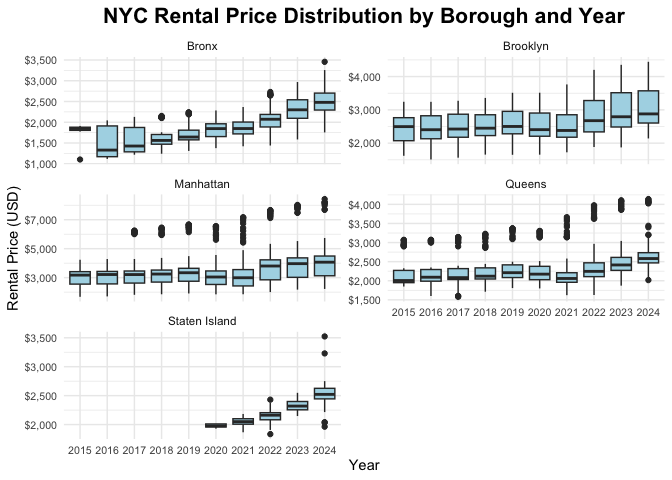
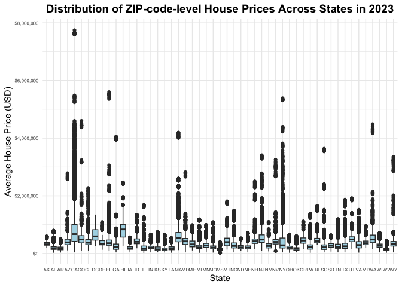
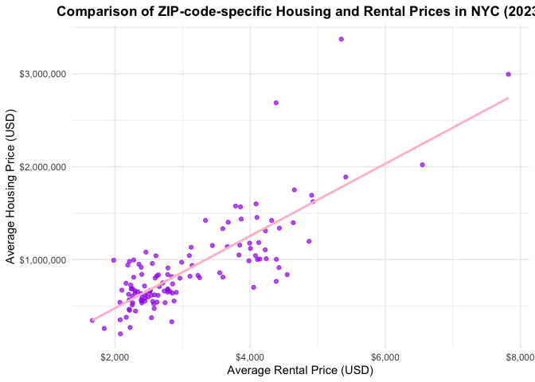

p8105_mtp_hl3859
================
Hanrui Li
2024-10-21

# 1

NYC Rental Dataset contains rental prices for ZIP codes in NYC
(2015-2024). Housing Value dataset contains housing prices for ZIP codes
across the U.S. (2023). NYC ZIP Code Dataset maps ZIP codes to
neighborhoods.

Our goal is to analyze trends in NYC rental and housing prices.

``` r
## Import and clean the NYC Rental data

library(dplyr)
library(tidyr)

nyc_rental <- 
  read.csv("Zillow/Zip_zori_uc_sfrcondomfr_sm_month_NYC.csv") |>
  janitor::clean_names() |> 
  # Standardize the variable names to be more readable.
  
  pivot_longer(
    cols = starts_with("x20"), 
    names_to = "date", 
    values_to = "rental_price") |>
  # Reshape seperate columns for each date into a longer format where each row represents a ZIP code for a specific date and its corresponding rental price.
  
  rename(zip_code = region_name, county = county_name) |>
  # Rename `region_name` and `county_name` into `zip_code` and `county` to get more readable.
  
  mutate(county = gsub(" County", "", county),
         date = gsub("x", "", date),
         # Remove unnecessary letters (" County" suffix from `county`) and ("x" prefix from `date`) to ensure conciseness and be more readable.
         date = as.Date(as.character(date), format = "%Y_%m_%d")) |> 
         # Convert the date to a readable format.
  
  select(zip_code, county, date, rental_price) |> 
  # Select only necessary variables for later parts.
  drop_na() 
  # Remove NA.

## Import and clean the ZIP code data

library(rvest)

zip_data <- 
  read_html("https://p8105.com/data/zip_codes.html") |>
  # Read the HTML content from a URL.
  html_table(fill = TRUE)
  # Extract tables or specific elements.

zip <- 
  zip_data[[1]] |>
  # Convert it to a data frame.
  janitor::clean_names() |> 
  # Standardize the variable names to be more readable.
  
  mutate(borough = case_when(
    county == "New York" ~ "Manhattan",
    county == "Kings" ~ "Brooklyn",
    county == "Queens" ~ "Queens",
    county == "Bronx" ~ "Bronx",
    county == "Richmond" ~ "Staten Island")) |> 
  # Create a borough column based on county variable, mapping counties to their corresponding NYC boroughs.
  
  select(zip_code, county, neighborhood, borough) |> 
  # Select only necessary variables for later parts.
  drop_na()
  # Remove NA.

## Merge the NYC Rental and ZIP code data

tidy <- merge(nyc_rental, zip, by = c("zip_code", "county")) |>
  # Merge the cleaned `nyc_rental` and `zip` datasets to a tidy data.
  drop_na() 
  # Remove NA.
```

Remove rows with missing values.

Unmatched ZIP codes, so use `merge()` on `zip_code` and `county` to keep
only rows having matching ZIP codes and counties in both datasets.

**Resulting dataset:**

- `zip_code`: ZIP code for the location

- `county`: county corresponding to the ZIP code

- `date`: date of observation

- `rental_price`: rental price for the given date and ZIP code

- `neighborhood`: neighborhood corresponding to the ZIP code

- `borough`: borough corresponding to the ZIP code

- **10128** total observations

- **143** unique zip codes

- **42** unique neighborhoods

``` r
## Import and clean the 2023 US Housing data

house_value <- 
  read.csv("Zillow/Zip_zhvi_uc_sfrcondo_tier_0.33_0.67_sm_sa_month_2023.csv") |>
  janitor::clean_names() |>
  # Standardize the variable names to be more readable.
  
  pivot_longer(
    cols = starts_with("x20"),
    names_to = "date",
    values_to = "home_value") |>
  # Reshape seperate columns for each date into a longer format where each row represents a ZIP code for a specific date and its corresponding rental price.
  
  rename(zip_code = region_name, county = county_name) |> 
  # Rename `region_name` and `county_name` into `zip_code` and `county` to get more readable.
  
  mutate(county = gsub(" County", "", county),
         date = gsub("x", "", date),
         # Remove unnecessary letters (" County" suffix from `county`) and ("x" prefix from `date`) to ensure conciseness and be more readable.
         date = as.Date(as.character(date), format = "%Y_%m_%d")) |>
         # Convert the date to a readable format.
  
  select(zip_code, county, state, date, home_value) |>
  # Select only necessary variables for later parts.
  drop_na()
  # Remove NA.
```

# 2

Incomplete data collection, newly developed areas, low rental activity
in certain areas, and possible gaps in reporting may cause some ZIP
codes not to have rental price data for every month.

``` r
# Number of ZIP codes in the NYC Rental dataset
length(unique(nyc_rental$zip_code))
```

    ## [1] 149

``` r
# Number of ZIP codes in the ZIP code dataset
length(unique(zip$zip_code))
```

    ## [1] 178

NYC rental dataset include only ZIP codes having rental data, while ZIP
code dataset includes all ZIP codes.

``` r
# Create a table showing the average rental price by borough and year

tidy |>
  mutate(year = format(date, "%Y")) |> 
  group_by(borough, year) |>
  summarize(avg_rent = mean(rental_price, na.rm = TRUE), .groups = "drop") |>
  arrange(borough, year) |> 
  pivot_wider(names_from = year, 
              values_from = avg_rent
  ) |>
  knitr::kable(caption = "Average Rental Price by Borough and Year")
```

| borough | 2015 | 2016 | 2017 | 2018 | 2019 | 2020 | 2021 | 2022 | 2023 | 2024 |
|:---|---:|---:|---:|---:|---:|---:|---:|---:|---:|---:|
| Bronx | 1759.595 | 1520.194 | 1543.599 | 1639.430 | 1705.589 | 1811.443 | 1857.777 | 2054.267 | 2285.459 | 2496.896 |
| Brooklyn | 2438.957 | 2472.313 | 2498.362 | 2505.957 | 2586.314 | 2511.527 | 2501.779 | 2812.270 | 2960.176 | 3073.922 |
| Manhattan | 3022.042 | 3038.818 | 3133.848 | 3183.703 | 3276.366 | 3076.963 | 3090.085 | 3684.257 | 3832.869 | 3957.503 |
| Queens | 2214.707 | 2204.981 | 2181.438 | 2215.430 | 2299.086 | 2240.459 | 2147.534 | 2333.882 | 2495.221 | 2638.235 |
| Staten Island | NA | NA | NA | NA | NA | 1977.608 | 2045.430 | 2147.436 | 2332.934 | 2536.442 |

Average Rental Price by Borough and Year

- By 2015-2019, rental prices grew steadily.
- In 2020 and 2021, there were fluctuations in rental prices due to
  pandemic, especially in Manhattan, which saw relatively significant
  drops in prices. Prices in Brooklyn remain relatively stable, and in
  Bronx increase slightly.
- By 2022–2024, rental prices recover, with increases across all
  boroughs, particularly in Manhattan and Bronx.

``` r
# Create a table showing rental price changes from January 2020 to January 2021

tidy |>
  filter(date %in% as.Date(c("2020-01-31", "2021-01-31"))) |>
  mutate(year = format(date, "%Y")) |> 
  select(zip_code, borough, neighborhood, year, rental_price) |>
  pivot_wider(names_from = year, 
              values_from = rental_price) |> 
  mutate(price_drop = `2020` - `2021`) |> 
  group_by(borough) |>
  filter(price_drop == max(price_drop, na.rm = TRUE)) |>
  select(borough, neighborhood, price_drop) |>
  arrange(desc(price_drop)) |> 
  knitr::kable(caption = "Drop in Rental Price from 2020 to 2021 for each Borough")
```

| borough   | neighborhood        | price_drop |
|:----------|:--------------------|-----------:|
| Manhattan | Lower Manhattan     |  912.59659 |
| Brooklyn  | Greenpoint          |  437.93809 |
| Queens    | West Central Queens |  216.97454 |
| Bronx     | Southeast Bronx     |   16.45535 |

Drop in Rental Price from 2020 to 2021 for each Borough

- The largest rental price drop \$912 occurred in **Lower Manhattan**.
- **Greenpoint** and **West Central Queens** also experienced notable
  drops by about \$437 and 217.
- **Southeast Bronx** has the smallest drop.

# 3

``` r
# NYC rental prices within ZIP codes for all available years

library(ggplot2)

plot1_df <- 
  tidy |>
  mutate(year = format(date, "%Y"))

ggplot(plot1_df, aes(x = year, y = rental_price)) +
  geom_boxplot(fill = "lightblue") +
  facet_wrap(~ borough, scales = "free_y", ncol = 2) +
  labs(title = "NYC Rental Price Distribution by Borough and Year",
       x = "Year",
       y = "Rental Price (USD)",
       fill = "Borough") +
  theme_minimal() +
  theme(plot.title = element_text(size = 16, face = "bold", hjust = 0.5),
        axis.text = element_text(size = 8)) +
  scale_y_continuous(labels = scales::dollar_format())
```

<!-- -->

``` r
ggsave("results/plot1_rental_price_borough.pdf", width = 14, height = 8)
```

- Manhattan has the highest rental prices, showing a steady increase,
  especially after pandemic. It also has many high outliers (exceeding
  \$7000 in 2024).
- Brooklyn and Queens show a similar upward trend, with moderate price
  dips during 2020–2021 due to the pandemic, followed by strong recovery
  starting in 2022.
- Staten Island has the lowest prices with less fluctuation.
- Bronx exhibits gradual price growth, but the overall range remains
  lower than Manhattan and Brooklyn.

``` r
# Distribution of ZIP-code-level house prices across states in 2023

plot2_df <- 
  house_value |> 
  filter(format(as.Date(date), "%Y") == "2023") |>
  group_by(zip_code, state, month = format(as.Date(date), "%m")) |>
  summarize(avg_price = mean(home_value, na.rm = TRUE), .groups = "drop")

ggplot(plot2_df, aes(x = state, y = avg_price)) + 
  geom_boxplot(fill = "lightblue") +  
  labs(title = "Distribution of ZIP-code-level House Prices Across States in 2023",
       x = "State", 
       y = "Average House Price (USD)") +
  theme_minimal() +
  theme(plot.title = element_text(size = 14, face = "bold", hjust = 0.5),
        axis.text = element_text(size = 6)) +
  scale_y_continuous(labels = scales::dollar_format())
```

<!-- -->

``` r
ggsave("results/plot2_house_distribution_state.pdf", width = 12, height = 8)
```

- CA, NY, and MA have the highest median house prices and the widest
  range, with many outliers over 4000000. States with booming
  metropolitan areas show both higher median prices and greater price
  variability.
- AL, MS, and OH exhibit much lower and more uniform house prices, with
  smaller spreads and no extreme outliers. States in the Midwest and
  South have more affordable and consistent housing prices.

``` r
# ZIP-Code-Specific Housing Prices vs. Rental Prices in 2023

plot3_df <- 
  nyc_rental |>
  filter(format(date, "%Y") == "2023") |>
  group_by(zip_code) |>
  summarize(avg_rent = mean(rental_price, na.rm = TRUE)) |>
  left_join(
    house_value |>
      filter(format(date, "%Y") == "2023") |>
      group_by(zip_code) |>
      summarize(avg_home_value = mean(home_value, na.rm = TRUE)),
    by = "zip_code")

ggplot(plot3_df, aes(x = avg_rent, y = avg_home_value)) +
  geom_point(alpha = 0.7, color = "purple") +
  geom_smooth(method = "lm", color = "pink", se = FALSE) +
  labs(title = "Comparison of ZIP-code-specific Housing and Rental Prices in NYC (2023)",
       x = "Average Rental Price (USD)",
       y = "Average Housing Price (USD)") +
  theme_minimal() +
  theme(plot.title = element_text(size = 13, face = "bold", hjust = 0.5)) +
  scale_x_continuous(labels = scales::dollar_format()) +
  scale_y_continuous(labels = scales::dollar_format())
```

<!-- -->

``` r
ggsave("results/plot3_price_comparison.pdf", width = 8, height = 5)
```

- **Positive correlation** between rental prices and housing prices. ZIP
  codes with higher rental prices tend to have higher housing prices.
- Most points are clustered between 2000–4000 for rental prices and
  500000–1500000 for housing prices.
- Some outliers, with one ZIP code showing a high housing price above 3
  million, despite having a moderate rental price around 4000.

**Limitations:**

- Missing data for some ZIP codes
- Lacks detailed neighborhood-level granularity
- Only 2023
- No information on property type or size
- Lacks socioeconomic or demographic context (income)
- Zillow may not capture full scope of NYC housing market
